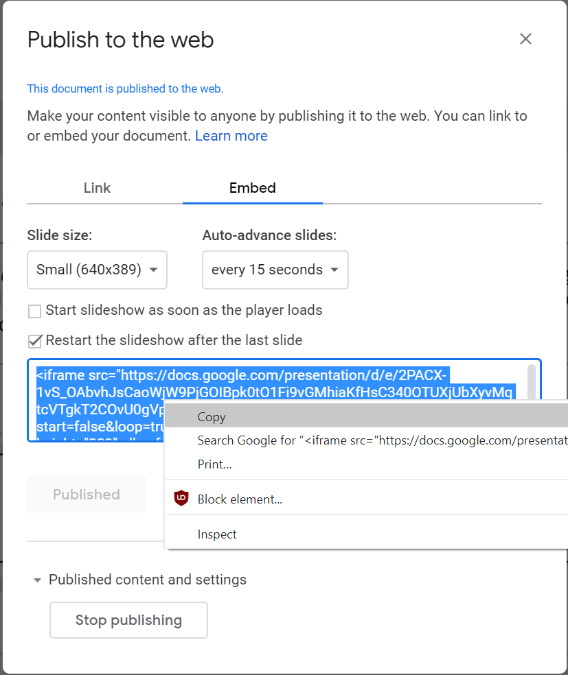

[BACK TO DAY 1 & 2 WORKSHET](eru-day-1-2.md)

# ERU - GitHub Pages Extra 
This is an optional set of additional tasks to show you more about configuring and using GitHub pages. These tasks should be followed after completing Exercise 13 on the [day 1 & 2 worksheet](eru-day-1-2.md).

More information and references for Markdown:
- [Mastering Markdown](https://guides.github.com/features/mastering-markdown/) 
- [Adam Pritchard's Markdown Cheatsheet](https://github.com/adam-p/markdown-here/wiki/Markdown-Cheatsheet)
- [Daring Fireball's Markdown Introduction](https://daringfireball.net/projects/markdown/)

## Create a second markdown (and web) page
- Create another markdown page in the ```docs``` folder. Name it as you wish, but ensure that it ends in ```.md```. Add a title and other elements as done earlier. 

## Customizing pages | What is jekyll?
You may have noticed by now that there is another file (```config.yml```) in your ```docs``` folder that you didn't create or put there. This is your configuration file, and it's written in a language called [YAML](https://en.wikipedia.org/wiki/YAML). The ```config.yml``` file was created at the time that you turned on GitHub pages, and it provides instructions to a static site generator software called [jekyll](https://jekyllrb.com/). GitHub pages uses jekyll in the background to convert your Markdown file(s) to formatted html to display as a webpages. 

There is ***a lot*** that you can do with jekyll (within GitHub pages and as a standalone application on your computer) to generate customized webpages. While only the theme information is set in your file initially, there are many ways that you can [customize](https://help.github.com/en/github/working-with-github-pages/about-github-pages-and-jekyll#default-plugins)  it. Here, we'll make a few simple ones:
- Use the GitHub editor to edit your ```config.yml``` file.
- beneath the first (theme) line, add the following: 

```
plugins:
  - jekyll-relative-links
relative_links:
  enabled: true
  collections: true
include:
  - <the name of your second page>.md

title: <your webpage title>
description: <description of your webpage> 
```

What this does:
- The ```plugins``` and ```relative-links``` lines make it easier for us to refer to files within our repository. 
- The include statement is used to indicate to jekyll which other Markdown pages should be converted to html pages. 
- The title and description statements allow you to override the repository name and description in the webpage title.
 
### More about Jekyll
From jekyllrb.com
>“Jekyll is a static site generator. You give it text written in your favorite markup language and it uses layouts to create a static website. You can tweak how you want the site URLs to look, what data gets displayed on the site, and more.”

GitHub pages uses jekyll to turn your markdown files (hosted in your GitHub repo) into html files and presents them on your desired website. 

Jekyll [webpage](https://jekyllrb.com/) and Jekyll project [on GitHub](https://github.com/jekyll/jekyll).

## Useful HTML to format pages and embed content
A nice feature of markdown (and jekyll) is that you can revert to HTML, when needed. This means that you can customize your website's appearance, and you can embed content like Google Slides and YouTube videos. 

### Line breaks
- If you would like a bit of extra space between lines, use the code ```<br>``` once or multiple times to provide line breaks. 

### Embedding a Google Slideshow
You can insert a published Google Slideshow directly into a GitHub markdown page, and have it appear in your rendered webpage. To do this: 
- In a Google Slideshow, click on >File>**Publish to the web**
- Click the *Embed* tab and select options. 
- Click on **Publish**. HTML embed code will be created in the content box.

- Copy the entire embed code and paste it into your markdown file. 
- Commit changes and refresh your webpage to see the embedded slideshow.

As an example, pasting the following code into this markdown file:
```
<iframe src="https://docs.google.com/presentation/d/e/2PACX-1vS_OAbvhJsCaoWjW9PjGOIBpk0tO1Fi9vGMhiaKfHsC340OTUXjUbXyvMqtcVTgkT2COvU0gVpJTA3o/embed?start=false&loop=true&delayms=15000" frameborder="0" width="640" height="389" allowfullscreen="true" mozallowfullscreen="true" webkitallowfullscreen="true"></iframe>
```
produces the following result: 
<iframe src="https://docs.google.com/presentation/d/e/2PACX-1vS_OAbvhJsCaoWjW9PjGOIBpk0tO1Fi9vGMhiaKfHsC340OTUXjUbXyvMqtcVTgkT2COvU0gVpJTA3o/embed?start=false&loop=true&delayms=15000" frameborder="0" width="640" height="389" allowfullscreen="true" mozallowfullscreen="true" webkitallowfullscreen="true"></iframe>
<br>
<br>

**NOTE**: That the slideshow will not render in the markdown page--you'll only see the embedded content in the GitHub Pages webpage.

### Embedding a YouTube video
- Find a video of choice on YouTube
- Right click the video and select ```<> Copy embed code```. 
- Paste the code directly into your markdown document. 
- Note that you may want to adjust the width and height parameters (in the embed code) to make it fit well in your webpage

For example, pasting the following code into this markdown file:
```
<iframe width="789" height="444" src="https://www.youtube.com/embed/dQw4w9WgXcQ" frameborder="0" allow="accelerometer; autoplay; encrypted-media; gyroscope; picture-in-picture" allowfullscreen></iframe>
```
produces the following result: 
<iframe width="789" height="444" src="https://www.youtube.com/embed/dQw4w9WgXcQ" frameborder="0" allow="accelerometer; autoplay; encrypted-media; gyroscope; picture-in-picture" allowfullscreen></iframe>

[BACK TO DAY 1 & 2 WORKSHET](eru-day-1-2.md)