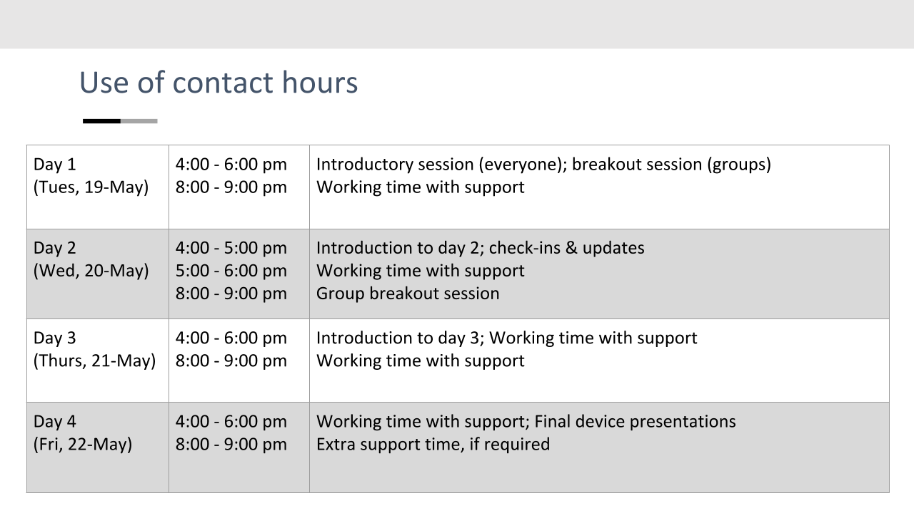

# Electronics for the Rest of US!
## Course outline

**Instructor**: Jay Brodeur
**Contact**: 	[brodeujj@mcmaster.ca](mailto:brodeujj@mcmaster.ca)

## Module description
Electronic devices are a vital part of our modern lives, as they enable (or at least mediate) most of our personal and academic activities. Despite this key role, many of us have little understanding of how they work, as well as and how to build useful electronic devices from relatively simple components. Thanks to the widespread availability of inexpensive, user-friendly and well-documented electronics like [Arduinos](https://www.arduino.cc/), learning and developing electronic skills has become attainable (and dare we say, even fun) for students of all ages and degrees of experience.  

In this module, students will develop their electronic fluency and build functional, useful devices through a collaborative, hands-on introduction to the fundamentals of electronics. Students will learn the basics by building simple circuits that integrate Arduino microcontrollers with various sensors and actuators. Participants will also gain experience with programming through developing the software code required to control the devices. Working with the instructor and small support groups, students will consolidate their learning by building a simple device that integrates a variety of sensors (temperature, light, etc.) and actuators (LEDs, buzzers, etc.). Students will document their work and share their final devices on their own simple project webpage, which will be created in GitHub Pages. 

## Module Objectives:
Through participation in the course, students will develop a number of knowledge- and skill-based competencies. By the end of this module, students will be able to:
1. Explain the fundamental concepts and operational principles of simple circuits, sensors and actuators;
2. apply fundamental principles to build simple circuits that interact with their surrounding environments;
3. create and modify software code to control the device’s functionality and create comments in the code to document its functionality;
4. use markdown and GitHub to share results on an openly-accessible webpage;
5. apply their skills, knowledge and creativity in the process of creating an original electronic device; 
6. explain basic principles of weather station design; and,
7. use basic and intermediate spreadsheet skills to load, clean, and visualize instrument data. 

## Module Structure and schedule: 
Students will be required to work approximately 3 hours per day for four consecutive days (May 19 to May 22). Working time will be split between synchronous classwork, synchronous groupwork, and asynchronous independent work. The instructor will be available for consultation during all working periods, regardless of whether synchronous activities are taking place. 

## Equipment and software required:
Students will require the following equipment to participate in the course: 
* A computer (preferably a laptop) with Windows, Linux, or Mac OS, with a USB connection and capable of installing [Arduino IDE software](https://www.arduino.cc/en/Main/Software). Chromebooks can be accommodated with a bit of effort.
* [Arduino IDE software](https://www.arduino.cc/en/Main/Software) installed.
* GitHub Desktop software is optional.
* A basic Arduino kit will be mailed to participants

## Assessment and module deliverables
All deliverables will be compiled in a GitHub repository that you will create for this module. You will upload a number of Ardunio sketches (code), and a few images that document your work. Descriptions of your work, and reflections on your progress will be compiled within a single [Markdown](https://en.wikipedia.org/wiki/Markdown) document that includes images and video of your final device. [GitHub Pages](https://pages.github.com/) will be used to turn your markdown document to a simple project webpage. 

| Deliverable | Weight | Notes |
|-------------|-------:|-------|
|Day 1 reflection + embedded photo| 15% |Started on Day 1; Completed on Day 2|
|Day 2 results + uploaded thermometer code| 20% |Completed on Day 2|
|Final device description + code + sales pitch video| 40% |Completed by Day 4|
|Final reflection & summary| 15% |Completed on Day 4|
|Overall project webpage quality|10%|       |

## Instructor Biography:
In his day job, Jay Brodeur is the Associate Director of Digital Scholarship Services in the McMaster University Library, where he oversees a variety of services that support research and instruction at McMaster. His background is in the Environmental Sciences, and his research interests include climate change, GIS and geomatics, and data management. When he can, Jay also enjoys teaching; he regularly teaches in the iSci program, and has been fortunate to instruct courses in the Faculties of Science, Social Sciences, and Humanities, as well as the Arts & Science Program. 

