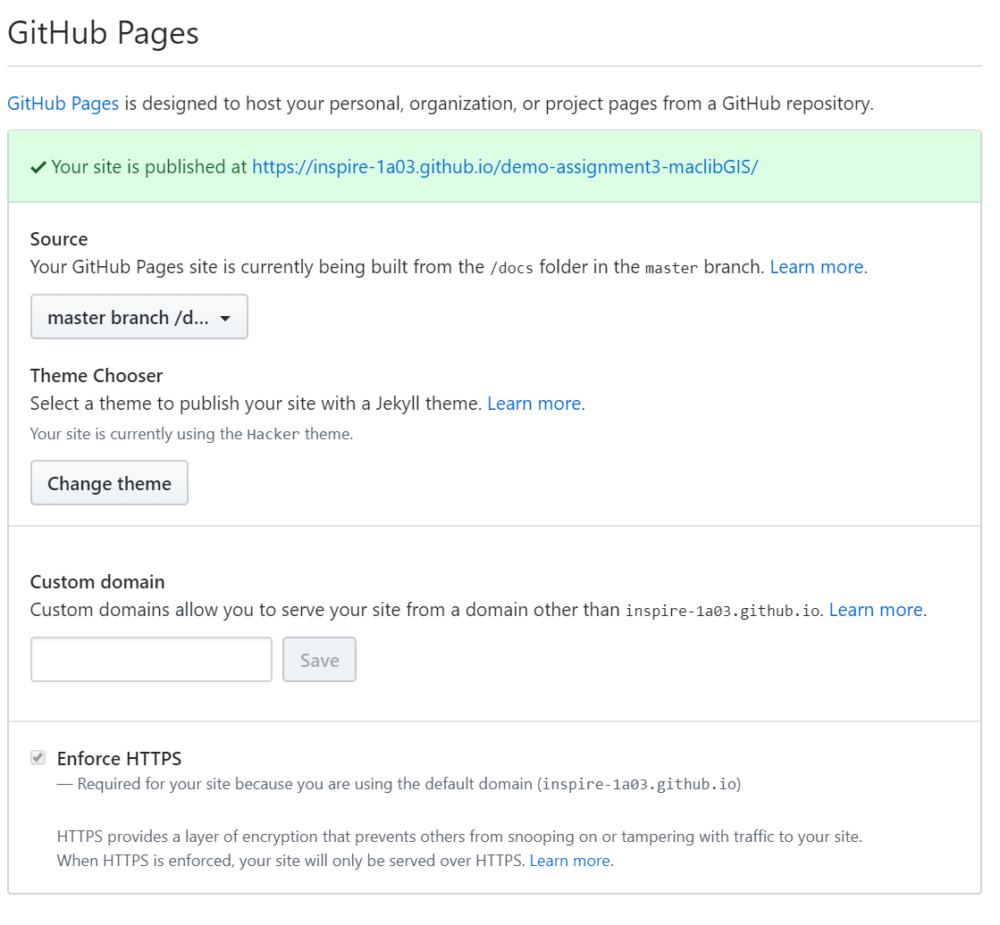

# ERU - Lesson Plan

## Welcome
- Introducing myself
- Around the horn introductions 
- Technology / Kits - Who doesn't have them yet? 
- Alterations to the schedule.

## Presentation
- Introductory lecture
- Show them the module webpage & explain resources
- Use of groups

## Getting Started
- Has everyone followed the pre-module activities? https://inspire-1a03.github.io/eru-2020/eru-setup.html
- If not. No worries. We'll walk through some of this today and you can do the rest during the working time.

## > Exercise 1: Physically connecting the Arduino to your computer
- ON LED
- L LED may be doing something
  - Program just keeps running
  - L connected to PIN 13
- Open IDE - explain the features
  - Serial connection 
  - 

## > Exercise 2: Uploading and running a program
- Open Blink; upload it 
  - Q. What is happening? 

## > Exercise 3: Understanding an Arduino sketch
- Explaining the Blink program
  - Comments
  - setup function
  - loop function

## > Exercise 4: Modifying a sketch
- Change sketch 
- Save your resulting sketch with a relevant name to directory
## > Exercise 5: Inserting an LED
- Connect both ways --does it work both ways? 

## > Exercise 6: Reviewing our circuit
- Go to blink page
  - Review requirements and wiring diagram

### Resistors 
- What are they? What do they do? 
- Colour codes (bring up diagram)
- Students figure out which ones they have
- resisto.rs & calculator

## > Exercise 7: Building a proper circuit

### Solderless breadboard
- Why use it? 
- How it is connected internally

#### Your tasks:
Create the proper blink circuit using: 
- The solderless breadboard
- The LED from the first circuit
- An appropriate resistor
- Jumper cables to connect the breadboard to the Arduino pins.
When you've succeeded, save your sketch to your local working folder with an appropriate name.

#### Notes:
If you are unsure of how to connect items in your circuit:
- Review the solderless breadboard diagram. 
- Try to trace the flow of current through your circuit from digital pin 13 to GND. Is there an opportunity for the current to avoid flowing through the LED? 
- Remember that any two (or more) items inserted into a connected row are all connected to each other at the same time--if you have all of your wires and LED legs plugged into a single row, the current will divert around your LED and flow straight from pin 13 to GND. Turn your LED 90 degrees (so legs are in different rows) and try again to connect the circuit.
<br>
<br>

## > Exercise 8: Using a button
- Use a button to turn on an LED 
- Keep your LED wired from first example
- How the button works

#### Your tasks: 
- Open the Button sketch from the Arduino IDE at >File>Examples>0.2Digital> and click on **Button**
- Navigate to the Arduino [Button tutorial page](https://www.arduino.cc/en/Tutorial/Button) to find the hardware requirements and circuit diagram.
- Take a close look at the code, and try to make sense of it.
- Complete the circuit wiring and upload the code to the Arduino.
- Verify that it works as desired. 
- Take a photo of your completed device in action (*you'll use this with your first reflection*).

#### Notes 2:
1. The 10K resistor serves as a pull-down resistor in this example, as it ensures that digital pin 2 is kept at LOW when the button is not pressed. Otherwise, the input may 'float', returning LOW and HIGH randomly, causing the LED to also blink randomly.  
2. This example declares both constants (values that won't change) and variables (values that may). 
  - The line ```const int buttonPin = 2;``` creates a constant (*const*) named *buttonPin* that is an integer (*int*, as opposed to other types--see [here](https://www.arduino.cc/en/Reference/VariableDeclaration) for more information), which has a value of 2. 
  - The line  ```int buttonState = 0;``` creates a variable named *buttonState* that is an integer with an initial value of 0.
3. In the line ```buttonState = digitalRead(buttonPin);```, the function *digitalRead* is used to read the state of the button on pin 2 (which is the value of buttonPin). The result (HIGH or LOW) is saved to the variable *buttonState*. 
4. An *if* statement is used to control the output on the ledPin (digital pin 13) depending on the value of *buttonState*.
  - An if statement takes the general form: 
```
if (condition1) {
  // do Thing A
}
else if (condition2) {
  // do Thing B
}
else {
  // do Thing C
}
```
See the [Arduino if-else reference guide](https://www.arduino.cc/reference/en/language/structure/control-structure/else/) for more information. 
<br>
<br>

# Part 3: Getting familiar with GitHub, Markdown, GitHub Pages (60 mins)
In this part, you'll learn about and gain experience with the other pieces of technology that will be used in this module: GitHub, Markdown, GitHub Pages. Used together, these tools will allow you to: 
- Document your work and store your code
- Keep track of version changes to your documents and code; restore previous versions, if necessary
- Create and publish a webpage that documents your work in this module with only a minimal amount of HTML knowledge. 

## Introduction
Follow along with the slideshow for an introduction to these tools, and an explanation of how we'll use them: 

<iframe src="https://docs.google.com/presentation/d/e/2PACX-1vS_OAbvhJsCaoWjW9PjGOIBpk0tO1Fi9vGMhiaKfHsC340OTUXjUbXyvMqtcVTgkT2COvU0gVpJTA3o/embed?start=false&loop=true&delayms=15000" frameborder="0" width="640" height="389" allowfullscreen="true" mozallowfullscreen="true" webkitallowfullscreen="true"></iframe>
<br>
<br>

## > Exercise 9: Create your own GitHub repository
In the exercises to follow, you'll create a GitHub repository for the purposes of learning how to use GitHub, Markdown, and GitHub pages.

#### Your tasks:
- From your GitHub main page, click on the green **New Repository** button. This is the repository (storage location) where the content of your website will be hosted. 
  - Provide a name for your repository. The name you enter will determine the URL of your repository.
    - i.e. ```https://github.com/<your-github-username>/<your-repo-name>```
	- e.g. ```https://github.com/jasonbrodeur/DASH-githubpages``` is a GitHub repository (*repo*, for short) that I've created in the past.
- Check the box to **Initialize this repository with a README**
- Click the **Create repository** button
- Your browser will now open to the top-level page of the repository. Your repository will contain one markdown file: **README.md**. 

#### Notes: 
- Your README file is a plan text file (same as a .txt file), but the **.md** extension is used so that GitHub recognizes that the file uses markdown inside. One of the nice features of markdown files is that they are readable by almost any applications, since they are plain text files.
<br>
<br>

## > Exercise 10: Create a folder and a text file within it
In this task, you'll create a folder that we'll need to initiate the webpage, and you'll learn how to create and edit files. 

#### Your tasks:
**Create a folder named ```docs```** in the top level of the repository. This is where the webpage content will live. We also want to **create a file in this folder called ```index.md```**. This will be the home page for your website.
- In the top-level repository page, click **Create new file**
- In the **Name your file...** box, enter ```docs/index.md```. Click **Commit change**. You will now have a folder named ```docs``` in your repository with a file named ```index.md```.

#### Notes:
- To create a file, simply enter the desired name and file extension. 
- To create a folder, you need to add a trailing slash (/) to the name, and you need to [create a file within the folder](https://github.com/KirstieJane/STEMMRoleModels/wiki/Creating-new-folders-in-GitHub-repository-via-the-browser), since empty folders aren't saved. You can always delete this file later.
<br>
<br>

## > Exercise 11: Edit your text file

#### Your tasks:
- Click on the ```index.md``` file to open it in the file viewer page
  - On the file viewer page, click the edit button (pencil icon) to switch to editing mode
  - Add a bit of text to this file (anything is fine). 
  - When finished editing, scroll to the bottom of the page to the **Commit changes** box. 
  
#### Notes:
- The **Commit changes** box is used to record information about changes before you commit them. 
  - (optional) If interested, modify the comment from **Update index.md** to something more descriptive
  - (optional) Add a description, if desired
- Click the **Commit changes** box to finalize your commit. Your changes will be represented in the file. 
- If you'd like to better understand how GitHub keeps track of file changes and history, from the **index.md** file viewing page, explore the **Blame** and **History** buttons.
<br>
<br>

## > Exercise 12: Exploring repository features and settings; Configuring GitHub Pages
In this step, we'll explore some of the functionality available in a GitHub repository and show you how to get started with [GitHub Pages](https://help.github.com/en/github/working-with-github-pages/about-github-pages)

#### Your Tasks:
- Ensure that you've created the ```docs``` folder and the ```index.md``` file, as outlined in the previous step.
- From the top-level repository page (i.e. the one where you can see the ```docs``` folder and ```README.md``` file:
  - Explore the various Features (tabs) that are available within a repository
  - Open the Settings Tab. Explore the various Settings tabs.
- On the **Options** subpage (topmost side menu item), scroll down to the **GitHub Pages** section
  - For **Source**, select **master branch /docs folder** (note you could also pick the *master branch* option, but not for this example.)
  - Click **Choose a theme** to select a theme for your webpage
- Congratulations, your website is ready. The link will be provided in the GitHub Pages section.
  - You may initially receive a 404 error, but after a minute, your website will appear with the content from ```index.md```
Remember: By default, GitHub Pages expects at least one file in the ```docs``` folder named ```index.md```. This becomes the main (home) page for the webpage.
**Now, it's time to add some content!**
<br>
<br>

## > Exercise 13: Creating content with Markdown
One of the really nice things about GitHub and GitHub Pages is that you can use Markdown to format text on a webpage without the use (or knowledge!) of html code (though you can insert it if you need to!). This makes it really easy to create content. In this section, you'll learn a bit more about Markdown and how to use it to create formatted text. 

### What is Markdown? 
Borrowed shamelessly from Github's [Mastering Markdown](https://guides.github.com/features/mastering-markdown/) page: 
> Markdown is a way to style text on the web. You control the display of the document; formatting words as bold or italic, adding images, and creating lists are just a few of the things we can do with Markdown. Mostly, Markdown is just regular text with a few non-alphabetic characters thrown in, like # or *.

Markdown uses simple notation to apply simple formatting rules. Since it's pretty much just plain text, it's transferable and much simpler than marked-up text like HTML or even Word or Google documents. It's also very readable in its plain text format, which is nice. For much of the writing that you do for the web, Markdown is good enough. Github uses Markdown for its documents (this document was created in markdown), as does a variety of other web platforms (Reddit and Trello, as examples). 

#### Note:
While editing markdown files in the GitHub editor, use the **Preview changes** tab to see (mostly) how it will render on the web. Note that some content (like html code) won't render properly on GitHub, but will on your webpage. 

#### Your tasks: 
- Using the Github editor, open ```index.md``` for editing and add some content to it. If you would like to add a title to your page, add the following text at the top:

```
---
title: <enter your title here>
---
```

- Use the [Mastering Markdown guide](https://guides.github.com/features/mastering-markdown/) as a reference (or other guides on the web) to create a fictional document that contains most of the following elements: 
  - Headings of a number of different levels
  - bolded, italicized text 
  - insert an image from the web
  - (optional) insert an image that is hosted in your GitHub repository
  - An ordered list
  - A bulleted list
  - A link to another website 
  - A snippet of code
  - A table
  - And finally, an emoji! 
<br>
- When satisfied, commit your changes
- Refresh your website main page to see the updates (note that it may take a minute to update).

## (Optional) Doing more with GitHub pages
If you're interested in learning how to add multiple pages to a site and embedding content like slideshows and YouTube videos, work through the additional tasks on the [GitHub Pages Extra](eru-github-pages-extra.md) page.

For more information and references for Markdown, refer to:
- [Mastering Markdown](https://guides.github.com/features/mastering-markdown/) 
- [Adam Pritchard's Markdown Cheatsheet](https://github.com/adam-p/markdown-here/wiki/Markdown-Cheatsheet)
- [Daring Fireball's Markdown Introduction](https://daringfireball.net/projects/markdown/)
<br>
<br>

# Part 4: Day 1 Wrap-Up (30 mins).
Now that you've been introduced to GitHub and markdown, it's time to create your first website with GitHub Pages, and add an image and text for your day 1 reflection. Refer to the module [outline page](eru-outline.md) for more information on evaluation criteria.

## Turn your module repository into a webpage 
- In your pre-module setup [instructions](eru-setup.md), you were instructed to use [this link](https://classroom.github.com/a/zuDd-h3v) to create a GitHub repository for this module. 
- Once this is completed, your repository will be created at a url of the form: ```https://github.com/inspire-1a03/intersession-2020/<your_github_username>```
  - Your repository comes pre-populated with a ```/docs``` folder with an ```index.md``` file inside of it. The **index.md** file is where you will create your project webpage. Some headings and comments have been added to this file to guide you through your deliverables.
- In your repository's top-level page, click on the *Settings* tab and scroll down 
  - On the **Options** sub-page (topmost side menu item), scroll down to the **GitHub Pages** section
  - For **Source**, select **master branch /docs folder**
  - Click **Choose a theme** to select a theme for your webpage
- The link will be provided in the GitHub Pages section. 

<br>
- For easy reference, copy the URL to your webpage, and paste it into the description box in your top-level repository page by clicking *Edit* and pasting the URL into the *Website* box and clicking *Save*.


## Add your reflection text
- Beneath the **Day 1:Reflection** heading, provide a ~250 word reflection on your first day of the module, and discuss why you're interested in this module and what you hope to take away from it.

## Upload your photo to your module GitHub repository
- Upload your photo of the device created in the **Button** example, to the ```/docs/images/``` folder of your module repository. 
  - Navigate to the ```/docs/images``` folder and click the **Upload files** button. 

- Select the file and commit changes (directly to the ```master``` branch.

## Insert your uploaded photo into the markdown file
- Edit your ```index.md``` file to insert the image beneath your day 1 reflection text. When inserting the file, refer to its location in the ```/images``` folder. For example, if your uploaded image was named ```firstday.png``` your markdown code would look something like the following (though the description and title may be different): 
```

```
<br>
<br>

# Part 5: Intermediate circuits (90 mins)
In the following examples, you'll build upon earlier work to create increasingly complex circuits that require unique code to work. 
<br>
<br>

## > Exercise 14: Using a potentiometer
In this example, you'll use a potentiometer (the blue turn dial) to control the brightness of your LED. 

#### Your tasks:
- Open the AnalogInOutSerial sketch from the Arduino IDE at >File>Examples>03.Analog> and click on **AnalogInOutSerial**
- Navigate to the Arduino [AnalogInOutSerial tutorial page](https://www.arduino.cc/en/Tutorial/AnalogInOutSerial) to find the hardware requirements and circuit diagram. **Note** that you'll need to connect your circuit using the solderless breadboard.
- Once you've connected your circuit and successfully uploaded your code, open up the serial monitor on the top-right of the IDE. 
- Adjust (turn) the potentiometer and observe the changes to the LED, as well as the output in the Serial Monitor.

#### Notes
1. In this example, the LED is connected to digital pin 9, which is one of six **pulse width modulation (PWM)** digital pins on the Arduino (denoted with a **"~"** symbol on the board). PWM allows a digital output (which is either LOW = OFF or HIGH = ON) to simulate an analog signal (which can assume any value between LOW and HIGH). The command ```analogWrite``` is used instead of *digitalWrite* in this case, since we're writing an analog value to pin 9.

2. The map function is very useful for scaling the range of one variable to another range. In this example, the analog signal (from the potentiometer) ranges between 0 and 1023, while the acceptable output range for the LED is 0 to 255. The map function proportionally scales the potentiometer value to a usable value for the LED. 
3. In this example, you've used the Serial Console to establish and carry out serial communication between the Arduino and the computer. The setup function line ```Serial.begin(9600);``` establishes the connection, and the input argument (9600) in this case, determines the rate of information transfer, also known as the *baud* rate (9600 kilobits per second in this case). Clicking the drop-down on the bottom-right of the Serial Console displays the different baud rates that can be used. Note that the baud rate stated in the code needs to match that set in the Serial Console to receive intelligible output.
4. In some cases (or at least on my Windows 10 laptop), the Serial Console won't appear on the screen when you click it. If this happens, you should be able to fix it by maximizing it in the explorer bar.

<br>
<br>

## > Exercise 15: Potentiometer out, photoresistor in
In this example, we’re going to start with the code and wiring used in the previous example, but replace the potentiometer with a photoresistor. The point of this is to demonstrate how both components can be used as control devices by providing variable resistances. This exercise will require you to merge the existing wiring and code from the [AnalogInOutSerial](https://www.arduino.cc/en/Tutorial/AnalogInOutSerial) example, and merge in elements of the [AnalogInput](https://www.arduino.cc/en/Tutorial/AnalogInput) example (namely, the photoresistor example). 

#### Your tasks:
- Use >File>Save As... to save a copy of the AnalogInOutSerial code to a new sketch file in your local working directory. Name the sketch with something descriptive. Use this code as the basis for this example. Upload it to the Arduino.
- Remove the wiring for the potentiometer, and replace it with the wiring shown for the photoresistor on the [AnalogInput](https://www.arduino.cc/en/Tutorial/AnalogInput) information webpage. 
- Once you have wired it properly (using the Serial Monitor to confirm), experiment with changing light levels on the photoresistor (using a bright light / covering it with your finger, etc.). Observe the results in the Serial Console (i.e. the range of input values from the photoresistor and the corresponding output values for the LED). Do the values span close to the entire ranges for these devices (0 to 1023 for the photoresistor and 0 to 255 for the LED)? 
  - If not, modify the **map** function in your code so that the LED brightness ranges from off to full brightness. 

#### Notes
1. Be sure to save your changes and re-upload the program as you make changes!
2. Notice in this example that the **5V** and **GND** pins of the Arduino are connected to the outside 'rails' of the breadboard, and that these rails are used to connect to the device. Given that the rails are connected down an entire column, this approach can be helpful when you need to connect more devices to **5V** and **GND** pins than are available.
 

<br>
<br>

## > Exercise 16: Connecting an RGB LED
Here, you'll be connecting an RGB LED to the Arduino, using a guide that has been provided by Adafruit--a company that provides a wide range of DIY electronics and tutorials. 

#### Notes:
- An RGB LED contains three LEDs (red, green, and blue) integrated into a single casing. By controlling the brightness of each colour (using PWM), it's possible to create a wide variety of colours. Three of the LED legs correspond to one of these LEDs; depending on which time of RGB LED is being used (common anode vs common cathode), the fourth leg connects to either HIGH (5V) or LOW (GND):
  - For common anode RGB LEDs, the longest leg connects to HIGH (5V), and each of the shorter legs act as cathodes. 
  - For common cathode RGB LEDs, the longest leg connects to LOW (GND), and each of the shorter legs act as anodes.  

#### Your tasks:
**PLEASE ASSUME YOU ARE USING A COMMON ANODE RGB LED AND FOLLOW INSTRUCTIONS ACCORDINGLY**
- Create a new sketch. Delete all of the code so that you have a blank sketch
- Follow along with the instructions provided on the [Adafruit Learn webpage](https://learn.adafruit.com/adafruit-arduino-lesson-3-rgb-leds/breadboard-layout) to connect the RGB LED to the Arduino via the breadboard. 
  - **NOTE**: Use your 220 &#937 resistors in place of the 270 &#937 resistors asked for on the instruction page. The RGB LEDs are tolerant to the small difference in resistance. In a pinch, you can even run these for a while without any resistors.
- Use the *Copy Code* button to copy the code provided on the [Arduino Sketch page](https://learn.adafruit.com/adafruit-arduino-lesson-3-rgb-leds/arduino-sketch) to the clipboard and paste it into your sketch. Straight copying and pasting from the webpage may cause some stray html characters to end up in your sketch and cause it to fail when compiling. Save the sketch with an appropriate filename.
  - Read through the code and try to understand how it works.
- As per the instructions, be sure to connect the longest leg to 5V power, and uncomment the line ```\\#define COMMON_ANODE``` by removing the ``\\`` characters to leave ```#define COMMON_ANODE```.
- Once the circuit has been wired properly, the code has been uploaded and the RGB LED is working, review the order of colours with what is detailed in the sketch. 

#### If the order of colours does not match what is expected
- Double-check your wiring. Make sure that the proper LED pins are connected to the proper Arduino pins.
- Ensure that you've uncommented the ```#define COMMON_ANODE``` line and uploaded the most recent version to the Arduino
- If these steps don't address the issue, investigate if you have a common cathode RGB LED by: 
  - Wiring the longest leg to **GND** instead of **5V**
  - Re-commenting the ```#define COMMON_ANODE``` so that it appears as ```//#define COMMON_ANODE```
<br>
<br>

## > Exercise 17: An RGB LED thermometer (AKA your final training task!)
In this example, your task is to use a thermistor to sense the temperature of your room (or your hand, or whatever), and have the RGB LED change its colour depending on the value. You'll need to merge the wiring and code from the previous example with those for a thermistor. In the steps below, we'll connect the thermistor first and then move code from the thermistor sketch into the RGB LED one. 

#### Your tasks:
- Keep your RGB LED wired as it was in the previous example.
- Open a new sketch and remove all of the default code. Keep the sketch from the last example handy, as well. You'll need it.
- Go to [this Thermistor example webpage](https://playground.arduino.cc/ComponentLib/Thermistor2/)
  - Wire the thermistor into the breadboard according to what's outlined under the **Thermistor Test Schematic** heading. Note that this schematic looks a little different than you're used to. It may take a few minutes to figure out what's being described.
    - **NOTE**: that in this example, you have to connect more than one component to **5V**, but there is only one **5V** pin available. Use jumpers to connect the **5V** and **GND** pins of the Arduino to the two separate rails, and then connect the RGB LED and thermistor to the appropriate rail using jumpers.
  - Copy the code provided beneath the **The Elaborate Code (cleaned up a bit)** heading and paste it into your blank sketch (be sure not to copy over any text outside of the code box). Review the code and attempt to understand how it works.
    - Notice that this sketch uses an additional function (called *Thermistor*), which takes the raw current reading, converts it to temperature in Celsius, and returns the value as a floating point number. This function is called within the loop function. 
- Save your sketch and upload it to the Arduino
- If the upload works, open up your Serial Monitor to inspect the temperatures being returned to the screen. **NOTE** that the baud rate needs to be changed in the Serial Console window to 115200, in order to correspond with the rate set in the setup function (```Serial.begin(115200);```).
  - Test the thermistor at different temperatures by touching it with your warmed-up hand, an ice pack, etc. Confirm that temperature changes in an expected manner. 
- Once you're confident that your thermistor is working, your task is to merge the relevant code from the thermistor example into the previous RGB LED code. 
  - Be sure to move pieces into the proper locations of the RGB LED script
    - lines before the setup function should be moved to above the setup function in the RGB LED script.
	- lines from the setup function should be moved into the setup function in the RGB LED script.
    - lines from the loop function should be moved into the loop function in the RGB LED script.
  - Note that you want only one setup and loop function in the final script.
- Next, you will want to replace the original content from the RGB LED loop function with code that will change the LED colour based on the value of temperature. There are likely many ways to accomplish this, but the most straightforward way is probably to use an [if/elseif/else](https://www.arduino.cc/reference/en/language/structure/control-structure/else/) statement. 
- Save your sketch to your working directory. 
<br>
<br>

## Part 6: Day 2 Wrap-up
Once you've completed your RBG LED thermometer: 
- Upload your saved sketch to the top-level directory of your GitHub repository. 
- Complete the **Day 2: Results** section in your project page (/docs/index.md) of your GitHub repository.
Refer to the module [outline page](eru-outline.md) for more information on evaluation criteria.


During the last hour of day 2, you'll be given an hour to chat with your breakout group peers to brainstorm ideas for your days 3 and 4 challenge: **The Great Arduino Make-Off**
- Review the instructions provided in your [Day 3 and 4 instruction page](eru-day3-4.md)
- Connect with your breakout group and discuss some ideas.

[BACK TO MAIN PAGE](index.md)
